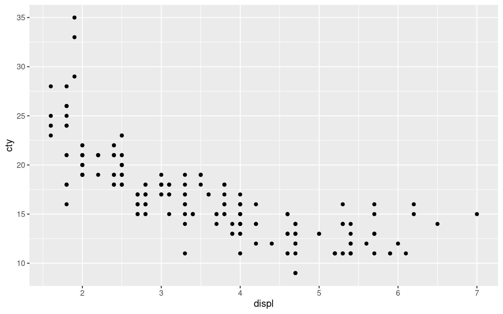
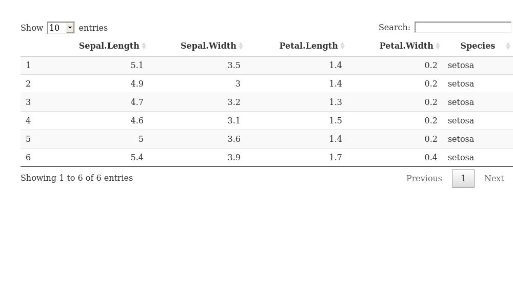
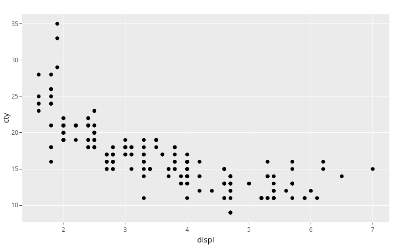

# Tests

## Citations

R Core Team (2020)

## Math

Example from the [mathjax demo](https://www.mathjax.org/#demo):

When *a* ≠ 0, there are two solutions to `\(ax^2 + bx + c = 0\)` and
they are

$$x = {-b \\pm \\sqrt{b^2-4ac} \\over 2a}.$$

If I have a random $ and another $ in my text.

## Preview Image

<div class="cell">

``` r
plt <- ggplot2::ggplot(ggplot2::mpg, ggplot2::aes(displ, cty)) +
  ggplot2::geom_point()
plt
```

<div class="cell-output-display">



</div>

</div>

## Details

<details>

<div class="cell">

``` r
print("hello world")
```

<div class="cell-output-stdout">

    [1] "hello world"

</div>

</div>

</details>

## p5

<script src="https://cdnjs.cloudflare.com/ajax/libs/p5.js/0.7.1/p5.min.js"></script>
<script src="https://cdnjs.cloudflare.com/ajax/libs/p5.js/0.7.1/addons/p5.sound.min.js"></script>
<link rel="stylesheet" type="text/css" href="p5_style.css">
<script src="sketch.js"></script>
<script src="puck.js"></script>
<script src="paddle.js"></script>

**w** and **s** move the left paddle, **o** and **l** move the right
paddle.

<div id="sketch-holder">

</div>

## Xaringan Slides

<div class="video-container">

<iframe src="/slides/test/index.html" data-external="1">
</iframe>

</div>

<style>
.video-container {
  width: 100%;
}
iframe {
  width: 100%;
  height: 100%;
  position: absolute;
  border: none;
}
</style>

## DT

<div class="cell">

``` r
DT::datatable(head(iris))
```

<div class="cell-output-display">



</div>

</div>

## Plotly

<div class="cell">

``` r
print("test")
```

<div class="cell-output-stdout">

    [1] "test"

</div>

``` r
plt <- ggplot2::ggplot(ggplot2::mpg, ggplot2::aes(displ, cty)) +
  ggplot2::geom_point()
plotly::ggplotly(plt)
```

<div class="cell-output-display">



</div>

</div>

However, while this options brings back plotly, it also disables math
rendering for this document on the site.

## Math

$$sd = \\sqrt{\\frac{\\sum\_{i=0}^{n}{(x_i-\\bar x)^2}}{(n-1)} }$$

## diagrammeR

<div class="cell">

``` r
DiagrammeR::mermaid(
"
graph TB
A-->B
A-->C
C-->E
B-->D
C-->D
D-->F
E-->F
")
```

<div class="cell-output-display">


</div>

</div>

<div id="refs" class="references csl-bib-body hanging-indent">

<div id="ref-rcoreteamLanguageEnvironmentStatistical2020"
class="csl-entry">

R Core Team. 2020. *R: A Language and Environment for Statistical
Computing*. Vienna, Austria: R Foundation for Statistical Computing.

</div>

</div>
