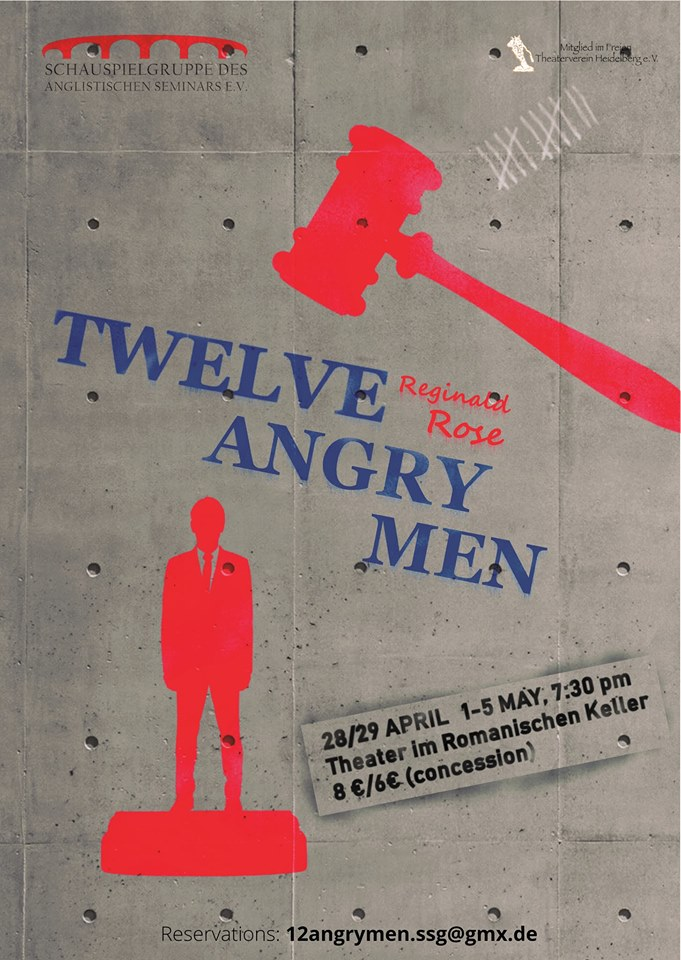

```{r setup, include=FALSE}
knitr::opts_chunk$set(echo = FALSE)
```

```{r prev, preview=TRUE}

```

# Teaser

A young man is accused of having killed his father, the evidence points in this
direction, the witnesses corroborate the story against him. His fate rests in
the hand of a jury - twelve men and women to decide if he should be executed.
Eleven jurors are certain he is the murderer, but for one some questions remain open.
This Anglistic Seminar performance approaches a modern classic from a fresh
perspective, drawing the audience into the moral conundrum.

[source](http://ssg-as-heidelberg.de/2018-season/)

