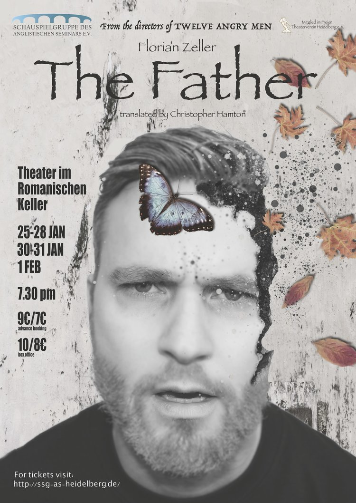

# Teaser

The Father (by Florian Zeller) tells the story of a father-daughter relationship, put under strain by the increasing dementia of the father. The story is told from the perspective of the father, André, and allows the audience to see the world through his perspective - with all the disjunctures, confusion and distress that dementia causes. 

The production is co-directed by Dennis Massmann and Timothy Williams (previously 'Twelve Angry Men') and integrates this modern dramatic farce with elements of physical theatre to transport the audience into the mind of André.

While the play is mildly disturbing, it is an important cultural contribution and allows the audience to see the world through the eyes of someone suffering from dementia.

You can by ticketes [online](https://secure.deskapp.de/shop/thefather/shopware.php?sViewport=cat&sCategory=50)!
